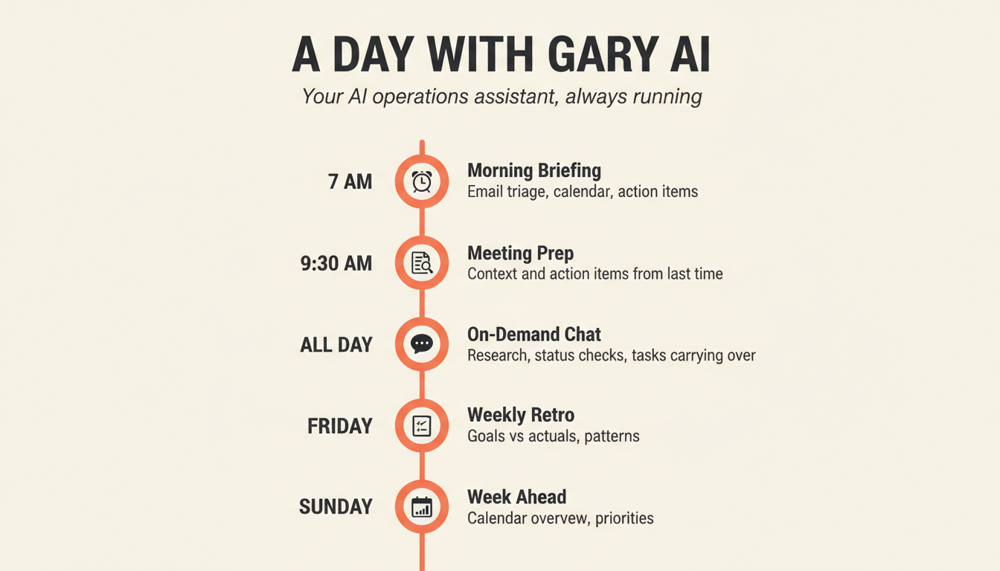
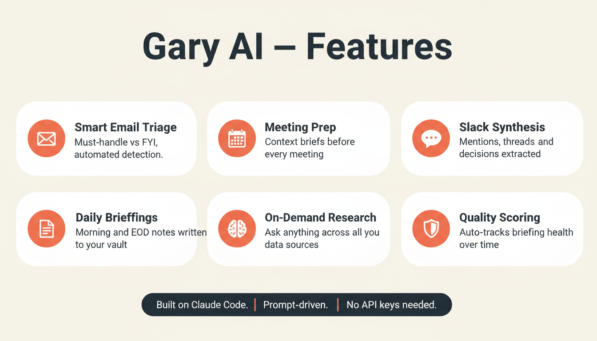

# Gary AI

**Your personal AI operations assistant, built on Claude Code.**

Gary reads your email, calendar, Slack, and meeting transcripts — then synthesizes them into daily briefings, action items, and on-demand research. Named after [Gary Walsh](https://veep.fandom.com/wiki/Gary_Walsh) from Veep — the aide who knows what you need before you ask.

<p align="center">
  
</p>

---

## What Gary Does

| When | What | Details |
|------|------|---------|
| Every morning | **Daily Briefing** | Email triage, calendar with prep notes, Slack mentions, GitHub status, proactive alerts, quality score |
| Before meetings | **Meeting Prep** | Last discussion, what's changed, fires to watch, your action items |
| All day | **On-Demand Chat** | Ask anything — status checks, research, draft replies, decision-ready docs |
| Every evening | **EOD Digest** | What got done, carry-forward tasks, tomorrow's first meeting |
| Friday | **Weekly Retro** | Goals vs. actuals, task scorecard, patterns to adjust |
| Sunday | **Week Ahead** | Calendar overview, key meetings, prioritized tasks |

<p align="center">
  
</p>

## How It Works

Gary runs on [Claude Code](https://docs.anthropic.com/en/docs/claude-code) (Desktop or CLI). It connects to your data sources via built-in MCP connectors — no API keys to manage, no custom code to write.

```
You ──→ Claude Code Desktop
           ├── Gmail (MCP connector)
           ├── Google Calendar (MCP connector)
           ├── Slack (MCP connector)
           ├── GitHub CLI (optional)
           └── Vault folder (local markdown files)
                ├── Daily notes (briefings + EOD digests)
                ├── Transcripts (meeting notes you drop here)
                └── Project docs (research, status docs)
```

Scheduled tasks run the briefing/digest/weekly prompts automatically. Your machine needs to stay awake for these to fire on time — a Mac Mini or desktop is the best setup, but laptops work too (Gary catches up when you open the lid). See [System Requirements](SETUP.md#before-you-start-system-requirements) for per-machine setup.

The vault is just markdown — point Obsidian at it for mobile sync, or just read the files.

## Get Started

**~30 minutes to set up. No coding required.**

Follow the walkthrough in **[SETUP.md](SETUP.md)**:

1. Install Claude Code
2. Connect your data sources (Gmail, Calendar, Slack)
3. Run the interactive onboarding (Gary asks 5 questions, writes your config)
4. Run your first morning briefing
5. Set up scheduled tasks so it runs itself

## Requirements

- [Claude Code Desktop](https://claude.ai/download) (macOS or Windows)
- Claude account with a Pro or Team plan
- Gmail / Google Calendar account
- Slack workspace (optional but recommended)
- GitHub account (optional)
- A machine that stays awake — desktop is ideal, laptop works with the right settings (see [System Requirements](SETUP.md#before-you-start-system-requirements))

## What Makes This Different

Most AI assistant setups are demos. Gary is a working pattern extracted from a production personal assistant that's been running daily since March 2026. The prompts, error handling, and data synthesis patterns have been iterated through real use.

The key insight: **scheduled tasks build context, and context makes on-demand work powerful.** Your morning briefing isn't just a summary — it's the foundation that lets you say "research the situation with [vendor]" and get a decision-ready doc in 10 minutes, because Gary already knows what's been discussed in Slack, what meetings happened, and what action items are open.

## Tech Stack

| Component | Role |
|-----------|------|
| [Claude Code](https://docs.anthropic.com/en/docs/claude-code) | Runtime — Desktop app or CLI |
| MCP Connectors | Gmail, Google Calendar, Slack integration |
| Markdown Vault | Local knowledge base (daily notes, transcripts, project docs) |
| Scheduled Tasks | Automated briefings, digests, and weekly reports |
| Prompt Engineering | Structured prompts with shared modules and error handling |

## Project Structure

```
gary-ai/
├── prompts/           # Scheduled task prompts (briefing, digest, retro, prep)
│   └── shared/        # Shared prompt modules (error handling, formatting)
├── config/            # Configuration files
├── vault/             # Your knowledge base (gitignored — personal data)
│   ├── daily/         # Archived daily + weekly notes
│   ├── transcripts/   # Meeting transcripts
│   └── projects/      # Project docs and research
├── state/             # Runtime state (gitignored)
├── SETUP.md           # Step-by-step setup guide
├── SOUL.md            # Gary's personality (customize this)
└── IDENTITY.md        # Gary's name and vibe (customize this)
```

## License

[MIT](LICENSE)
